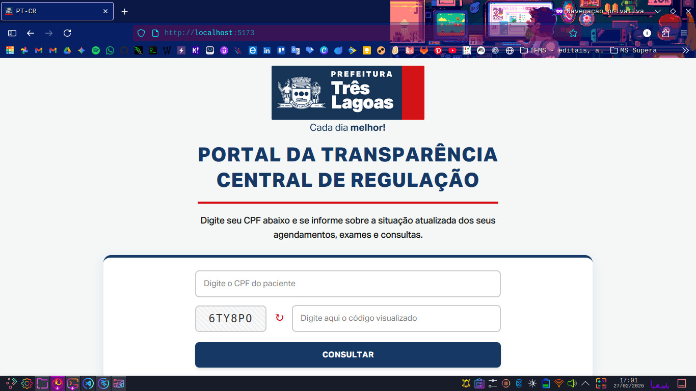
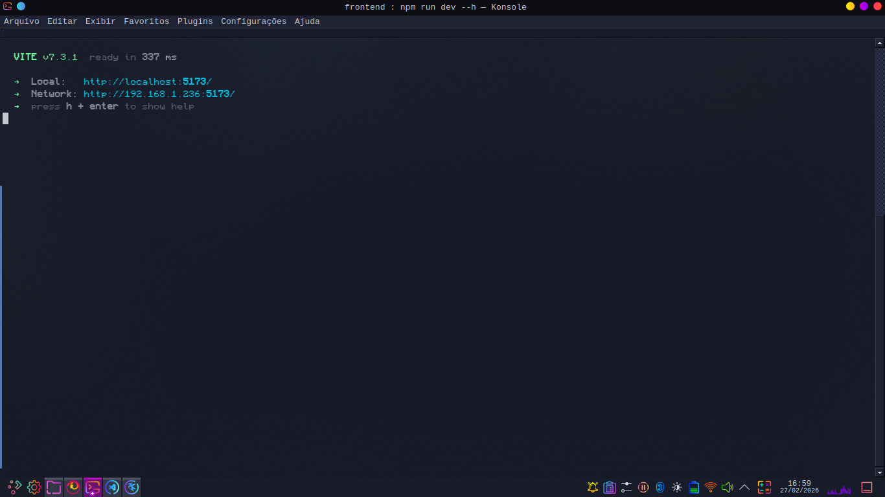
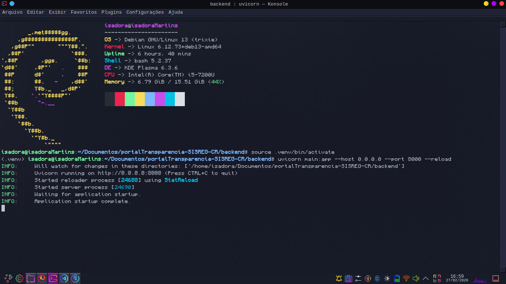

# 🏥 Portal da Transparência - Central de Regulação (SISREG)


> Uma interface simples e segura para consulta pública de filas de procedimentos da Central de Regulação do município de Três Lagoas - MS.
>
> **📍 Democratizando o acesso à saúde pública com tecnologia e transparência!**

https://github.com/user-attachments/assets/b55e80fa-acc2-4a23-8654-7860c7a4954c

---

## 📸 Sobre o Projeto

> Projeto desenvolvido como solução para a Saúde, através do projeto **PET-Saúde Digital – Grupo 7: Integração de Sistemas de Informação.**

**Objetivo:** Facilitar o acesso dos cidadãos de **Três Lagoas - MS** às informações sobre a fila de procedimentos do município.

Atuando como um *proxy* otimizado sobre o sistema SISREG, o portal oferece uma experiência de usuário (UX) superior, com foco em **rapidez, clareza e acessibilidade**.

*(Interface para consulta do cidadão)*

### ✨ Principais Funcionalidades

* 🔍 **Consulta Assíncrona Dupla:** Busca simultânea e otimizada nas bases de Solicitações e Marcações do SISREG.
* 🛡️ **Segurança em Duas Etapas:** Implementação de Captcha visual anti-bot e validação cruzada do nome da mãe direto no banco do SISREG.
* 📄 **Filtro Inteligente de Histórico:** Exibição focada nas demandas ativas do paciente e no histórico consolidado dos últimos 5 anos.
* 🧩 **Tratamento Avançado de Dados:** Unificação automática de contatos, formatação de laudos e agrupamento inteligente de múltiplos procedimentos no mesmo pedido.
* 🧹 **UX Aprimorada:** Separação visual clara de "Agendamentos Futuros" e limpeza automática de dados sensíveis ao alternar CPFs.
* 🎨 **Identidade Visual Oficial:** Design alinhado à Prefeitura de Três Lagoas.

---

## 🛠️ Tecnologias

O projeto foi construído utilizando uma arquitetura moderna separada em **Frontend** e **Backend**.

### **Frontend (Cliente)**

   

* **React.js + Vite:** Para uma SPA (Single Page Application) veloz.
* **Axios:** Para requisições HTTP assíncronas.
* **CSS Modules (Custom Properties):** Variáveis globais (`:root`) para manutenção centralizada de cores e fontes.

*(Terminal do frontend)*

### Backend (Servidor)

 

* **FastAPI:** Framework Python de alta performance para APIs.
* **HTTPX & Asyncio:** Para comunicação assíncrona, paralela e não-bloqueante com o servidor do governo.
* **Dotenv:** Gerenciamento seguro de variáveis de ambiente.
* **Uvicorn:** Servidor ASGI para produção.

*(Terminal do backend)*

---

## 📂 Estrutura do Projeto

A estrutura foi pensada para manter o código limpo e desacoplado (Clean Architecture):

```bash
PortalTransparencia/
│
├── backend/                # API Python (FastAPI)
│   ├── main.py             # Lógica de Proxy e conexão com SISREG
│   ├── requirements.txt    # Dependências do Python
│   └── .env                # Variáveis de ambiente (Segurança)
│
├── frontend/               # Interface React (Vite)
│   ├── src/
│   │   ├── components/     # Componentes reutilizáveis
│   │   ├── assets/         # Fontes (Aktiv Grotesk) e Logo
│   │   ├── App.jsx         # Lógica da Aplicação
│   │   └── App.css         # Design System e Variáveis CSS
│   ├── .env                # Variáveis de ambiente do Front (API URL)
│   └── package.json        # Dependências do Node
│
└── README.md               # Documentação
```

---

## 🚀 Como Executar o Projeto

Siga os passos abaixo para rodar a aplicação em seu ambiente local...

### Pré-requisitos

* [Node.js](https://nodejs.org/) (v18 ou superior)
* [Python](https://www.python.org/) (v3.10 ou superior)
* Git

### 1️⃣ Configurando o Backend (API)

Acesse a pasta do backend e prepare o ambiente Python:

```bash
# Entre na pasta
cd backend

# Crie um ambiente virtual
python3 -m venv .venv

# Ative o ambiente virtual (Linux/Mac)
source .venv/bin/activate
# Ou (Windows)
.venv\Scripts\activate

# Instale as dependências contornando bloqueios de ambiente do SO
python3 -m pip install -r requirements.txt
```

#### 🔐 **Variáveis de Ambiente (.env)**

Crie um arquivo chamado `.env` na raiz da pasta `backend` e configure as credenciais de acesso:

```
SISREG_USUARIO=seu_usuario_sisreg
SISREG_SENHA=sua_senha_sisreg
```

**Rodando o Servidor:**

```
python3 -m uvicorn main:app --host 0.0.0.0 --port 8000 --reload
```

### 2️⃣ Configuração do Frontend (Interface)

Em um novo terminal, acesse a pasta do frontend:

```
# Entre na pasta frontend
cd frontend

# Instale as dependências do projeto
npm install
```

#### 🔗 **Conexão com a API (.env)**

Crie um arquivo `.env` na raiz da pasta `frontend` para apontar para o seu backend local:

`VITE_API_BASE_URL=http://localhost:8000/api`

**Iniciando a Aplicação:**

```
# Inicie o servidor de desenvolvimento
npm run dev
```

✅ *O Frontend estará rodando em: `http://localhost:5173`*

### 3️⃣ Como testar no Celular (Rede Local)

Como o sistema é totalmente responsivo, você pode testá-lo no navegador do seu smartphone. Ambos os dispositivos **(computador e celular)** **precisam estar conectados à mesma rede Wi-Fi**.

1. Descubra o endereço de IP local do seu computador (Ex: `192.168.1.1`).

* No Windows: abra o terminal e digite `ipconfig`.
* No Linux/Mac: abra o terminal e digite `hostname -I` ou `ifconfig`.

2. No arquivo `.env` do Frontend, troque a palavra `localhost` pelo seu IP:

`VITE_API_BASE_URL=http://192.168.1.1:8000/api`

3. Inicie o Frontend liberando o acesso para a rede, adicionando `--host`:

`npm run dev -- --host`

4. Pegue o seu celular, abra o navegador e digite o endereço que aparecerá no terminal do Vite (Ex: `http://192.168.1.1:5173`).

---

## 🧪 Como Utilizar o Portal

1. **Acesso:** Abra o navegador em `http://localhost:5173`.
2. **Identificação:** Digite o CPF do paciente e o código de verificação (Captcha) exibido na tela.
3. **Consulta:** Clique em "CONSULTAR".
4. **Segurança Adicional:** Confirme o primeiro nome da mãe do paciente para validar a identidade junto ao SISREG.
5. **Termo de Consentimento:** Verifique os dados parcialmente ofuscados no Modal de Segurança e declare ser o titular.
6. **Resultados:** Visualize a lista completa e formatada de procedimentos, utilize os filtros de situação/ano e navegue pela paginação.

---

## 👩🏽‍💻 Realização

**Isadora de Souza Martins**

`Estudante de Engenharia de Computação`

* GitHub: [isamartins-engcomput](https://github.com/isamartins-engcomput)
* LinkedIn: [Isadora Martins](https://www.linkedin.com/in/isadora-martins-611478332)
* E-mail pessoal: [isadoramartins1906@gmail.com](mailto:isadoramartins1906@gmail.com)
* E-mail institucional: [isadora.martins2@estudante.ifms.edu.br](mailto:isadora.martins2@estudante.ifms.edu.br)

### 🫂 Apoio

Este software é uma entrega técnica vinculada ao:

* **Programa:** PET-Saúde Digital
* **Eixo:** Transformação Digital na Saúde
* **Grupo 7:** Integração de Sistemas de Informação

O projeto visa fortalecer a integração ensino-serviço-comunidade, aplicando conhecimentos da Engenharia de Computação para resolver demandas reais do Sistema Único de Saúde (SUS).

---

## 🫱🏼‍🫲🏻 **Contribua com o Projeto**

> Este software é fruto de muita dedicação e estudo, desenvolvido com o propósito de servir à comunidade.
>
> Acredito que o conhecimento cresce quando compartilhado, portanto, se você tem ideias para torná-lo mais acessível, rápido ou seguro, sua ajuda é fundamental.
>
> Sinta-se à vontade para contribuir! :)

<p align="center">
  <em> ✨ Tecnologia é a ferramenta, cuidar de pessoas é a missão! ✨</em><br>
  <br>
  Copyright © 2026 <strong>Isadora Martins</strong><br>
  Engenharia de Computação • IFMS
</p>
