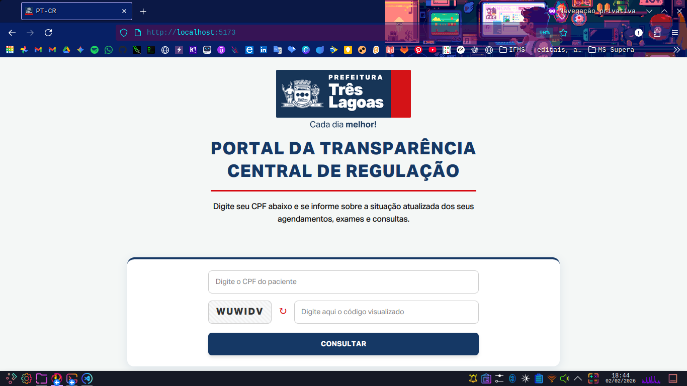
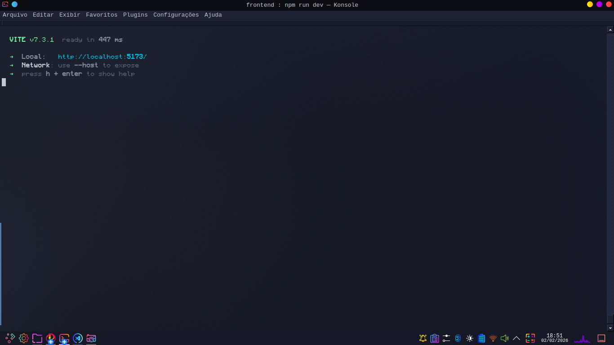
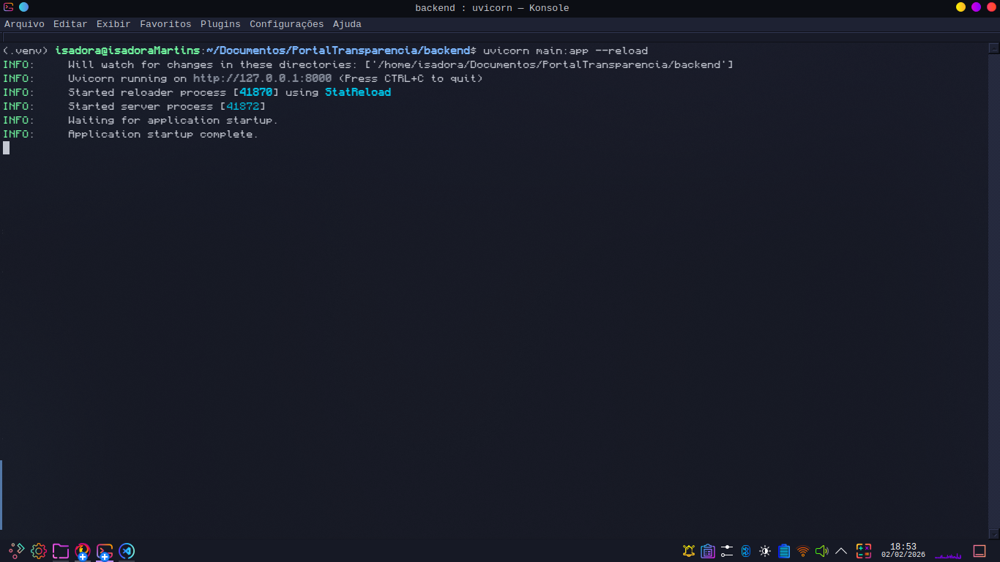

# 🏥 Portal da Transparência - Central de Regulação (SISREG)


> Uma interface simples e segura para consulta pública de filas de procedimentos da Central de Regulação do município de Três Lagoas - MS.
>
> **📍 Democratizando o acesso à saúde pública com tecnologia e transparência!**

https://github.com/user-attachments/assets/b55e80fa-acc2-4a23-8654-7860c7a4954c

---

## 📸 Sobre o Projeto

> Projeto desenvolvido como solução para a Saúde, através do projeto **PET-Saúde Digital – Grupo 7: Integração de Sistemas de Informação.**

**Objetivo:** Facilitar o acesso dos cidadãos de **Três Lagoas - MS** às informações sobre a fila de procedimentos do município.

Atuando como um *proxy* otimizado sobre o sistema SISREG, o portal oferece uma experiência de usuário (UX) superior, com foco em **rapidez, clareza e acessibilidade**.

*(Interface para consulta do cidadão)*

### ✨ Principais Funcionalidades

* 🔍 **Consulta Atualizada:** Conexão direta com a API do SISREG via Backend Proxy.
* 📄 **Paginação & Histórico Completo:** Capacidade de carregar históricos extensos (até 10.000 registros) com navegação fluida.
* 🛡️ **Segurança Anti-Bot:** Implementação de Captcha Inteligente para proteger a API contra requisições maliciosas.
* 🧹 **UX Aprimorada:** Limpeza automática de dados sensíveis ao alternar entre CPF's.
* 🎨 **Identidade Visual Oficial:** Design alinhado à Prefeitura de Três Lagoas.

---

## 🛠️ Tecnologias

O projeto foi construído utilizando uma arquitetura moderna separada em **Frontend** e **Backend**.

### **Frontend (Cliente)**

   

* **React.js + Vite:** Para uma SPA (Single Page Application) veloz.
* **Axios:** Para requisições HTTP assíncronas.
* **CSS Modules (Custom Properties):** Variáveis globais (`:root`) para manutenção centralizada de cores e fontes.

*(Terminal do frontend)*

### Backend (Servidor)

 

* **FastAPI:** Framework Python de alta performance para APIs.
* **Python Requests:** Para comunicação com o servidor do governo.
* **Dotenv:** Gerenciamento seguro de variáveis de ambiente.
* **Uvicorn:** Servidor ASGI para produção.

*(Terminal do backend)*

---

## 📂 Estrutura do Projeto

A estrutura foi pensada para manter o código limpo e desacoplado (Clean Architecture):

```bash
PortalTransparencia/
│
├── backend/                # API Python (FastAPI)
│   ├── main.py             # Lógica de Proxy e conexão com SISREG
│   ├── requirements.txt    # Dependências do Python
│   └── .env                # Variáveis de ambiente (Segurança)
│
├── frontend/               # Interface React (Vite)
│   ├── src/
│   │   ├── components/     # Componentes reutilizáveis
│   │   ├── assets/         # Fontes (Aktiv Grotesk) e Logo
│   │   ├── App.jsx         # Lógica da Aplicação
│   │   └── App.css         # Design System e Variáveis CSS
│   └── package.json        # Dependências do Node
│
└── README.md               # Documentação
```

---

## 🚀 Como Executar o Projeto

Siga os passos abaixo para rodar a aplicação em seu ambiente local...

### Pré-requisitos

* [Node.js](https://nodejs.org/) (v18 ou superior)
* [Python](https://www.python.org/) (v3.10 ou superior)
* Git

### 1️⃣ Configurando o Backend (API)

Acesse a pasta do backend e prepare o ambiente Python:

```bash
# Entre na pasta
cd backend

# Crie um ambiente virtual (Opcional, mas recomendado)
python -m venv venv

# Ative o venv (Windows)
venv\Scripts\activate
# Ou (Linux/Mac)
source venv/bin/activate

# Instale as dependências
pip install fastapi uvicorn requests python-dotenv
```

#### 🔐 **Variáveis de Ambiente (.env)**

Crie um arquivo chamado `.env` na raiz da pasta `backend` e configure as credenciais de acesso:

```
SISREG_USUARIO=seu_usuario_sisreg
SISREG_SENHA=sua_senha_sisreg
```

**Rodando o Servidor:**

```
uvicorn main:app --reload --host 0.0.0.0 --port 8000
```

### 2️⃣ Configuração do Frontend (Interface)

Em um novo terminal, acesse a pasta do frontend:

```
# Entre na pasta frontend
cd frontend

# Instale as dependências do projeto
npm install

# Inicie o servidor de desenvolvimento
npm run dev
```

✅ *O Frontend estará rodando em: `http://localhost:5173`*

---

## 🧪 Como Utilizar o Portal

1. **Acesse:** Abra o navegador em `http://localhost:5173`.
2. **Identifique-se:** Digite o CPF do paciente.
3. **Segurança:** Digite o código de verificação (Captcha) exibido.
4. **Consulta:** Clique em "CONSULTAR".
5. **Confirmação:** Valide as iniciais e data de nascimento no Modal de Segurança.
6. **Resultado:** Visualize a lista completa de procedimentos, filtre por ano ou status e navegue pela paginação.

---

## 👩🏽‍💻 Realização

**Isadora de Souza Martins**

`Estudante de Engenharia de Computação`

* GitHub: [isamartins-engcomput](https://github.com/isamartins-engcomput)
* LinkedIn: [Isadora Martins](https://www.linkedin.com/in/isadora-martins-611478332)

* E-mail pessoal: [isadoramartins1906@gmail.com](mailto:isadoramartins1906@gmail.com)
* E-mail institucional: [isadora.martins2@estudante.ifms.edu.br](mailto:isadora.martins2@estudante.ifms.edu.br)

### 🫂 Apoio

Este software é uma entrega técnica vinculada ao:

* **Programa:** PET-Saúde Digital
* **Eixo:** Transformação Digital na Saúde
* **Grupo 7:** Integração de Sistemas de Informação

O projeto visa fortalecer a integração ensino-serviço-comunidade, aplicando conhecimentos da Engenharia de Computação para resolver demandas reais do Sistema Único de Saúde (SUS).

---

## 🫱🏼‍🫲🏻 **Contribua com o Projeto**

> Este software é fruto de muita dedicação e estudo, desenvolvido com o propósito de servir à comunidade.
>
> Acredito que o conhecimento cresce quando compartilhado, portanto, se você tem ideias para torná-lo mais acessível, rápido ou seguro, sua ajuda é fundamental.
>
> Sinta-se à vontade para contribuir! :)


<p align="center">
  <em> ✨ Tecnologia é a ferramenta, cuidar de pessoas é a missão! ✨</em><br>
  <br>
  Copyright © 2026 <strong>Isadora Martins</strong><br>
  Engenharia de Computação • IFMS
</p>
